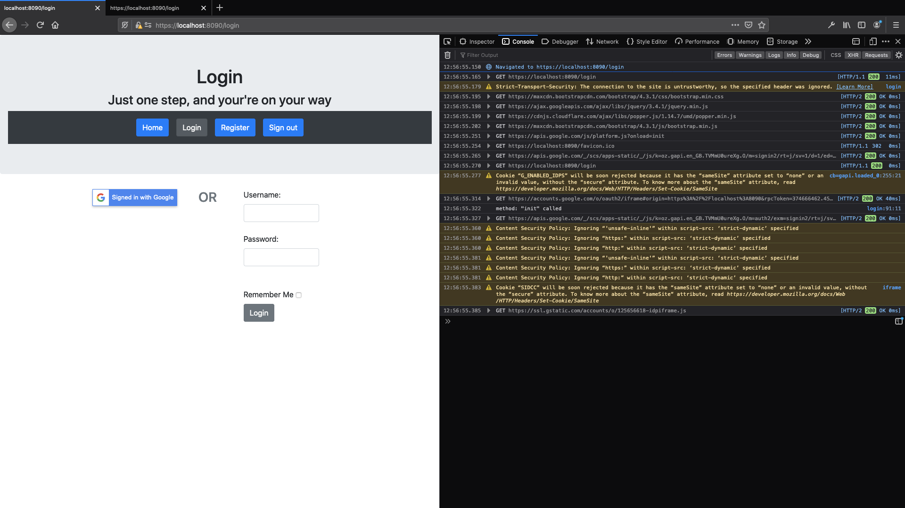
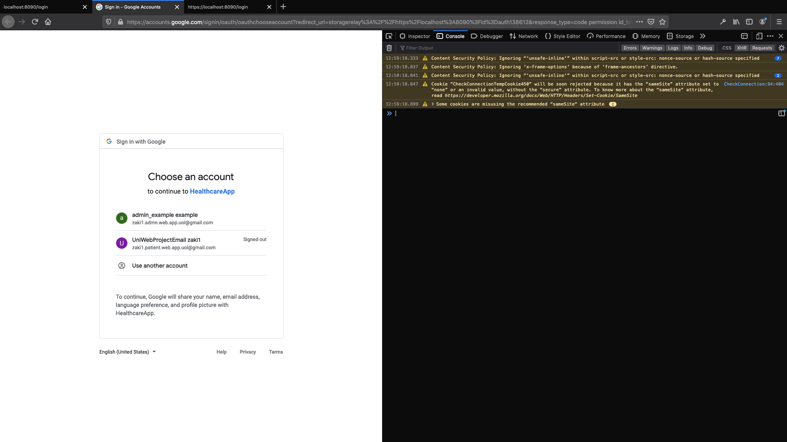
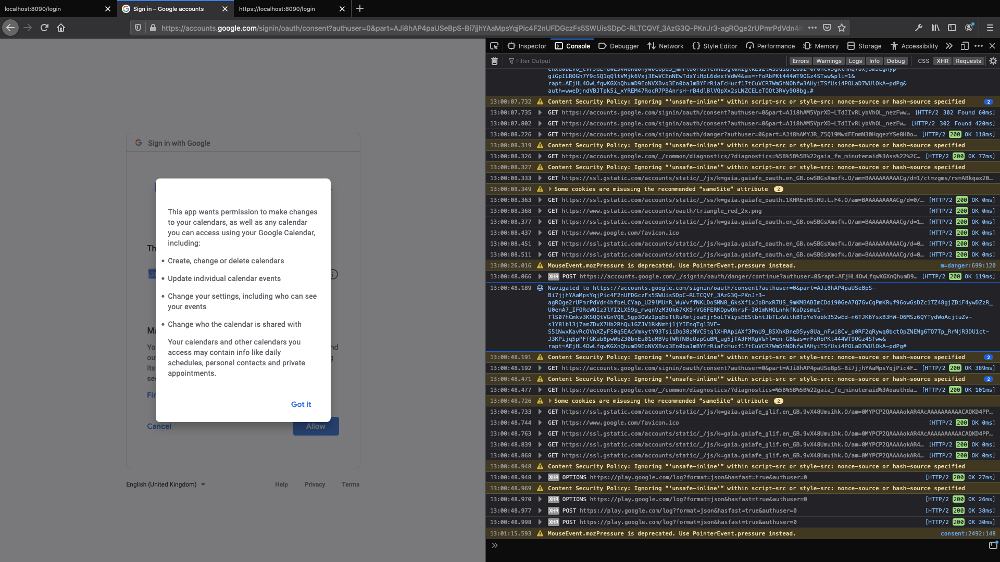
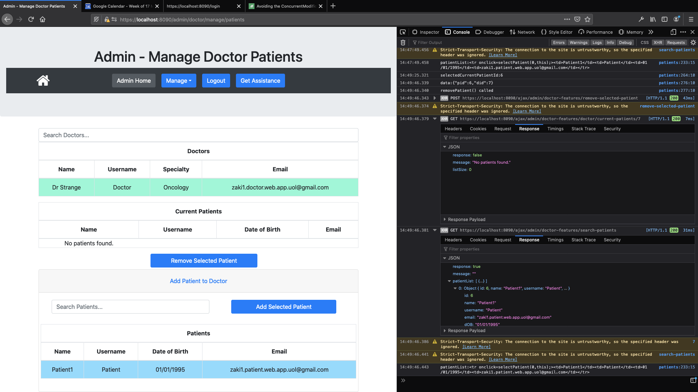
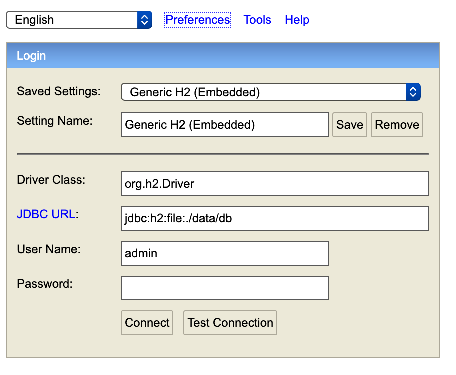

# Chronic Patient's Health App
This something I made for a University Project but was version controlled on the University SVN, but I've added here for a personal copy. Many aspects of the idea were not completed, as it was a big undertaking for one person (it being the first large project that I have managed on my own). 

Though the idea was not fully realised due to complications in working with Google API's [see problems](#project-shortcomings), though everything done was sufficient to demonstrate skill in the related technologies and software development required to do well in the university module/class.

As this project was for university, it is online for the purpose of being on display as part of a portfolio of my work, but cannot be forked or used for any purpose beyond to be observed as evidence of my work and epxerience.

## Tables of Contents
* [Background](#background)
* [Images](#images)
* [Technologies](#technologies)
* [Requirements to run the project](#requirements-to-run-the-project)
* [Setup](#setup)
* [Running the project](#running-the-project)
* [Project Shortcomings](#shortcomings)
* [Modifications](#modifications)

## Background
My project was to create a system that would allow patients with chronic illness to arrange the ordering of their repeat prescriptions online rather than in person as well as to book appointments online. The purpose of this is to save them time that could be put to better use.

## Images






## Technologies
- Java 
- Gradle
- Spring MVC Framework + Spring Security
- Hibernate
- MySQL

    ### API'S
    - Google Sign In

## Requirements to run the project
You will need to have java 11 or higher installed and on your classpath in order to run the project.

Optionally you can use a local installation of gradle to build and run this, but there


## Setup
In order to run the project, you will need to configure the MySQL database settings. You can configure the database to be either a local or remote MySQL database. To do this you will need to fill in the application.properties file with your database configuration.

For example you can download MySQL Server and create and local MySQL database instance, or (if you are comfortable using ssh tunnelling and have a raspberry pi) you can download MariaDB server to the pi, run a server instance and then using ssh tunnelling can run the application with the remote settings.

## Running the Project
From the terminal, cd the project directory. Once inside the directory: 

On Mac and Linux
```
./gradlew bootRun
```

On Windows
```
./gradlew.bat bootRun
```

Once the boot process is complete, you can then view the website from https://localhost:8090/ (if you are using default configurations). 

There for each type their are 3 users (i.e. {usertype}{number} - e.g. Admin2).

You can login to the application using these credentials:
|username | password|
|:---:|:---|
|Admin1  | password|
|Admin2  | password|
|Admin3  | password|
|Patient1 | password|
|Patient2 | password|
|Patient3 | password|
|Doctor1 | password|
|Doctor2 | password|
|Doctor3 | password|
 

To access the H2 console to view the database go to https://localhost:8090/h2-console/ and enter:

Saved Settings: Generic H2 (Embedded)

Settings Name: Generic H2 (Embedded)

Driver Class: org.h2.Driver

JDBC URL: jdbc:h2:file:./data/db

User Name: admin

Password: admin

as shown in the image below:


The admin functionality is the most complete of the 3 system user types, though there still remains a lot left undone.

## Project Shortcomings
 ### Main
Google Sign In successful retrieves the authentication token from the Google Sign In API but I was unable to complete the storage and retrival of that token from the database for Sign In. A lot of the problems faced came from usinga lot to time work try to understand google's vast API and ecosystem. 

In the end how it became clear that my difficulty in integrating Google Calendar came from not understanding earlier on that significant portions of user functionality are only avaiable throught setting up as "serivce account" which is very diffierent from a regualr google account. For service accounts to function as intended one must register a payment account and have it linked to an organisation.

What I have made in the end turned out to be as far as I could make it trying to work with what is free on the Google Developer console without registering an account and organisation for payment.

There's still a lot I have to learn on regarding the Google Developer Console, but I was able to learn about some of the setup required and considerations involved in Enterprise Software development as well as learning about token authentication for the first time from the view point of a developer. 

### Aside
Apart from this, some of the difficulty lay in knowing just how to integrate this with Spring's existing framework for authentication in the way which I intended to implement it, with the user already having been signed up in the system (as the system should only allow registration of users by the admin confirmed as chronic health patients or doctor's of that surgery), so that not just anyone could sign up. 

This meant I had to try to make a slightly more custom solution for Google Sign In, which brought with it, it's own complications on top of those previously mentioned. This being besdies that fact that I wanted Google Sign in to be an option that could be selected and unselected by users, as more an appendage to the regular account, which doesn't seem to be a consideration in Spring Framework, which is shown to support third party sign up and sign in, but not for having an existing account on the platform and then to be signed in via third party authentication (or at least I was unable to find any guidance on this approach from any existing documentation of the time).

The project also does not have testing in place, mainly because I was focussed on trying to get as much of the idea realised as possible within time constraints.

### Summary
Overall, as mentioned, many aspect would still require some work to be complete and though the assignment/assessment is done, I would like to add some testing and finish off project as intented just for myself for the sake of completeness and finshing up what was started.

For now, however, it serves to show my understanding of Java, HTML, CSS, Javascipt, Gradle, Spring MVC and Hibernate at the time and in future maybe updated as I am able to in between working on other personal projects.

## Modifications

I have since gone back and have worked on completing aspects of the project not related to Google Cloud/Console [see here for explaination](#main).